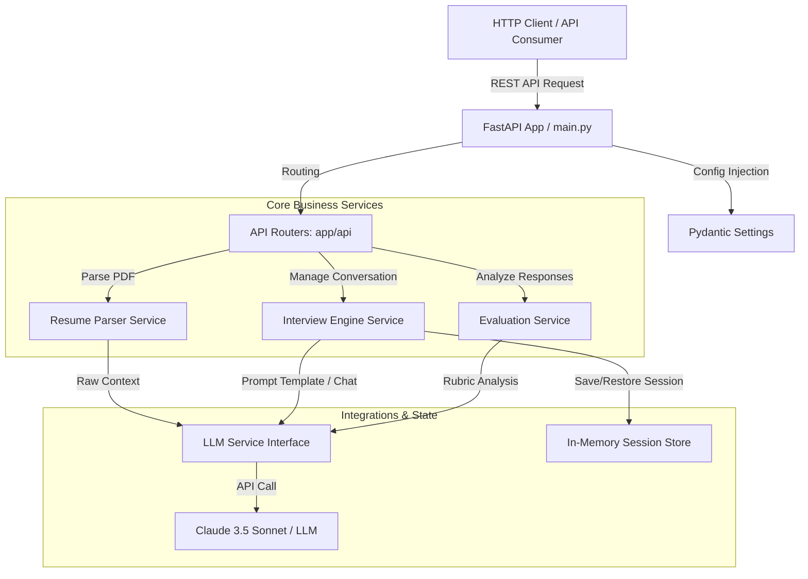

# Steps AI Mock Interview Platform 🚀

[](https://fastapi.tiangolo.com)
[](https://www.python.org)
[](https://www.anthropic.com)
[](https://opensource.org/licenses/MIT)

An advanced, enterprise-grade AI-powered Mock Interview system developed for the **Steps AI National-Level Online Hackathon 2026**. The platform automates candidate assessments by analyzing resumes, carrying out a context-aware conversational mock interview, and providing automated multi-dimensional grading reports.

---

## 📌 Selected Problem Statement

### **Problem Statement 2: AI Mock Interview Platform**
> Develop an intelligent mock interview system that:
> 1. Analyzes uploaded resumes.
> 2. Conducts personalized, conversational interviews.
> 3. Generates role-based questions.
> 4. Evaluates candidate responses.
> 5. Provides comprehensive feedback and improvement suggestions.
> 
> *Domains Involved: Conversational AI, Resume Intelligence, AI Evaluation Systems, Career Technology.*

---

## 📽️ Demo Video
> 🎬 **Demo Video Link**: [Insert YouTube or Google Drive Link Here]

---

## 🛠️ Tech Stack Used

- **Core Framework**: [FastAPI](https://fastapi.tiangolo.com/) (High-performance Python Web Framework)
- **Generative AI & LLM Engine**: [Anthropic Claude 3.5 Sonnet](https://www.anthropic.com/) (Via official `anthropic` SDK)
- **PDF Extraction**: [PyMuPDF / fitz](https://pymupdf.readthedocs.io/) (Ultra-fast PDF text parsing)
- **Data Validation & Settings**: [Pydantic V2 & Pydantic-Settings](https://docs.pydantic.dev/)
- **Testing Suite**: [Pytest](https://docs.pytest.org/) & [HTTPX](https://www.python-httpx.org/) (Async testing)
- **Process Manager / Server**: [Uvicorn](https://www.uvicorn.org/)

---

## 🏗️ Backend Architecture & System Design

The system is built on clean, modular, and testable design principles, decoupling network request layers, business workflows, and external service providers:



---

## ⚙️ Implementation Approach & Workflow

The pipeline consists of four key phases:

1. **Resume Ingestion**: The candidate uploads their resume (PDF). `PyMuPDF` extracts the raw text. It is passed to Claude with structured instructions, returning a clean, validated JSON schema containing skills, experiences, and estimated job roles.
2. **Contextual Questioning**: Based on the candidate's resume analysis, the engine creates custom behavioral, HR, and technical questions.
3. **Conversational Engine**: A multi-turn conversation tracker stores messages and simulates an actual recruiter, adapting questions according to the candidate's answers.
4. **Multi-Dimensional Grading**: Individual answers are graded (1-10) for clarity, technical depth, and relevance. A compiled PDF report outlines gaps and growth areas.

---

## 🌟 Features & Functionalities

- [x] **Full REST API scaffolding** with automated OpenAPI docs (/docs)
- [x] **Modular enterprise layout** decoupling configurations, routing, models, and services
- [ ] **Resume Intelligence**: Fast PDF parsing and structured JSON profiling (Phase 2)
- [ ] **Conversational Recruiter**: Interactive AI role-play with custom follow-ups (Phase 3)
- [ ] **Rubric Grading & PDF Export**: Detailed performance sheets with visual scores (Phase 4)
- [ ] **Docker containerization & structured logs** (Phase 5)

---

## 🔑 Environment Variables Required

Create a `.env` file in the root directory based on `.env.example`:

| Variable Name | Type | Description | Default |
| :--- | :--- | :--- | :--- |
| `PROJECT_NAME` | String | Title of the API project | `Steps AI Mock Interview Platform` |
| `ENV` | String | Running stage (`development` or `production`) | `development` |
| `HOST` | String | Network address to bind the server | `0.0.0.0` |
| `PORT` | Integer | System port to open for the server | `8000` |
| `LOG_LEVEL` | String | Verbosity of terminal output (`info`, `debug`, etc.) | `info` |
| `ANTHROPIC_API_KEY` | String | API credential key from Anthropic Console | *Required for interview engine* |

---

## 🚀 Setup Instructions to Run Locally

### 1. Prerequisites
- Python 3.10 or higher
- Git

### 2. Installation Steps

1. **Clone the Repository**:
   ```bash
   git clone https://github.com/YOUR_GITHUB_USERNAME/stepsai.git
   cd stepsai
   ```

2. **Create a Virtual Environment**:
   ```bash
   python -m venv venv
   source venv/bin/activate  # On Windows: venv\Scripts\activate
   ```

3. **Install Dependencies**:
   ```bash
   pip install --upgrade pip
   pip install -r requirements.txt
   ```

4. **Setup Environment**:
   ```bash
   cp .env.example .env
   # Open .env and insert your ANTHROPIC_API_KEY
   ```

5. **Start the Application**:
   ```bash
   uvicorn app.main:app --reload
   ```
   
   The server will start running at `http://127.0.0.1:8000`.

6. **Interactive Documentation**:
   - Access Swagger UI: [http://127.0.0.1:8000/docs](http://127.0.0.1:8000/docs)
   - Access Redoc: [http://127.0.0.1:8000/redoc](http://127.0.0.1:8000/redoc)

---

## 🧪 Running Automated Tests

We use `pytest` for automated test suites:

```bash
pytest
```
